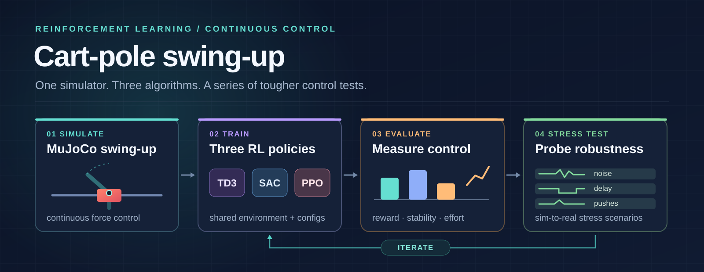
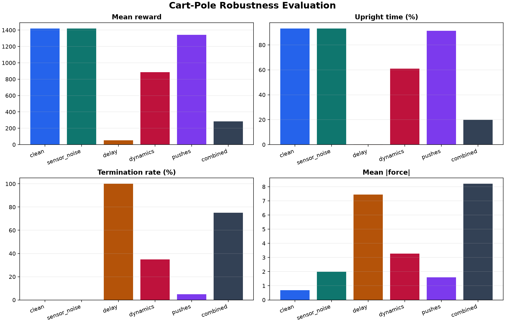
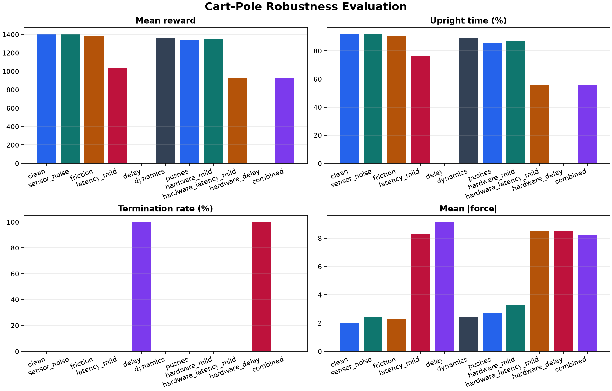
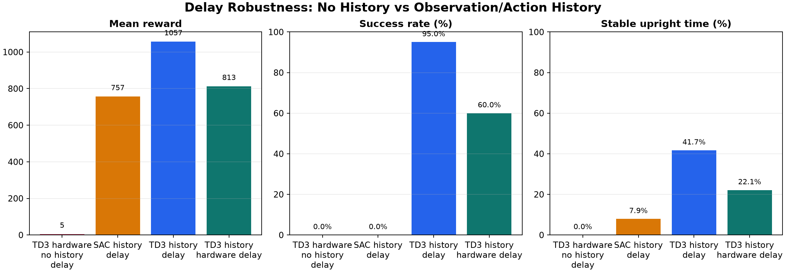

# cartpole-robot



MuJoCo cart-pole swing-up with a custom Gymnasium environment, normalized continuous actions, and model-free RL baselines.

This is not the standard `CartPole-v1` task. The goal is to start with the pole hanging downward, apply horizontal force to the cart, swing the pole upright, and stabilize it there.

For the learning roadmap from classic RL to visual control, sim2real, ROS 2 hardware, and VLA-style systems, open [docs/index.html](docs/index.html). For the current checkpoint matrix and next experiment plan, open [docs/status.html](docs/status.html). For the chronological development log, open [docs/PROJECT_LOG.md](docs/PROJECT_LOG.md).

## Experiments at a Glance

The plots below are from saved evaluations in the [visual project guide](docs/index.html). The reported success rates are measured in simulation; the hardware-like scenarios add disturbances and timing effects to the MuJoCo environment.

### TD3, SAC, and PPO baselines

All three trained policies reach 100% success in the clean, 500-step evaluation: mean rewards are **1417** for TD3, **1411** for SAC, and **1420** for PPO. PPO needed a longer training continuation to match the off-policy baselines. [Watch the three learned policies](docs/index.html#learned-policy-rollouts) or read the [TD3](experiments/01_td3_baseline/README.md), [SAC](experiments/02_sac_baseline/README.md), and [PPO](experiments/03_ppo_baseline/README.md) experiment notes.

### Push recovery



Training PPO with repeated pushes raises success on the `pushes` scenario from **75% to 95%** over 20 evaluation episodes. The combined-stressor result is still only **20%**, so this checkpoint is specifically for disturbance recovery. [See the paired push rollouts](docs/index.html#robust-sim-before-hardware).

### Hardware variation and delay



TD3 trained with hardware-like variation reaches **100% success** on `hardware_mild` over 20 episodes, but the two-tick `hardware_delay` scenario remains a failure case. The latter needs a controller that can use recent observations and actions.



With four observation frames and three previous actions, the TD3 history policy reaches **95% success** on `delay` and **60%** on `hardware_delay` over 20 episodes. These are specialized checkpoints for different conditions, not one universal controller. [Explore the robustness experiments and videos](docs/index.html#robust-sim-before-hardware).

## Why Custom

- `CartPole-v1` has a discrete action space, so it is not suitable for TD3.
- `InvertedPendulum-v5` has continuous actions, but it starts near upright and terminates when the pole falls, so it is a balance task rather than swing-up.
- `CartPoleSwingUp-v0` keeps MuJoCo physics, starts near the downward position, and uses one continuous action for cart force.

## Environment

The policy sees a 5D observation:

```text
[cart_position, cart_velocity, sin(pole_angle), cos(pole_angle), pole_angular_velocity]
```

Delay-history policies intentionally expand this input with recent observations and
previous actions. The included TD3 delay-history checkpoint uses 23 inputs:
`4 * 5D observations + 3 * 1D actions`.

The policy outputs one normalized action:

```text
action in [-1, 1]
```

The environment maps that to physical cart force:

```text
force = action * 10
```

The reward encourages the pole to be upright and stable while penalizing cart drift, high velocity, and excessive force.

### Control Ticks and Latency

One tick is one policy/control step. The MuJoCo XML uses a 20 ms physics timestep,
and the environment uses `frame_skip = 2`, so the policy acts every 40 ms:

```text
1 tick = 2 physics steps = 40 ms
```

Therefore:

```text
latency_mild = 1 delayed tick ~= 40 ms
delay        = 2 delayed ticks ~= 80 ms
```

On hardware, measure the time from encoder sampling to policy inference to motor
driver update, then divide that latency by 40 ms to estimate the equivalent number
of simulated ticks. If the real loop runs at a different policy rate, recompute
the tick duration from that real control period.

### Control-Loop Profiles

Hardware-like command and sensing effects are opt-in. The default profile is
`none`, which preserves the behavior of the earlier trainers, evaluators,
recorders, and checkpoints.

Available profiles:

```text
none                       no added timing or actuator effects
policy_25hz_latency        one-tick observation delay and one-tick action delay
policy_25hz_jitter         one-tick delay plus occasional extra timing jitter
policy_25hz_hardware_safe  latency, jitter, slew limit, deadband, filtering, quantization
policy_25hz_hardware_delay two-tick delay plus hardware-safe command/sensor effects
```

Evaluate an existing history policy under a hardware-like control loop:

```bash
uv run cartpole-robot-robust-eval \
  --algo td3 \
  --model models/best/td3_cartpole_swingup_delay_history_obs4_act3_best_20260629-023430.zip \
  --scenarios hardware_mild \
  --control-loop-profile policy_25hz_hardware_safe \
  --observation-history-steps 4 \
  --action-history-steps 3
```

Train a new policy later with the realistic control loop and history inputs:

```bash
uv run cartpole-robot-train \
  --config configs/algorithms/td3_realistic_control_loop_history.toml
```

Use `hardware_mild` plus a control-loop profile to combine physical variation
with timing effects. Use `hardware_delay` plus a control-loop profile only when
you intentionally want a harsher double-delay stress test.

## Setup

```bash
uv sync
```

## Quick Start

Watch the included trained policy:

```bash
uv run cartpole-robot-watch
```

Run a random policy for comparison:

```bash
uv run cartpole-robot --render --render-fps 25
```

Check that the custom environment is compatible with Stable-Baselines3:

```bash
uv run cartpole-robot-check
```

## Training Baselines

Train TD3, SAC, or PPO from config files:

```bash
uv run cartpole-robot-train --config configs/algorithms/td3.toml
uv run cartpole-robot-train --config configs/algorithms/sac.toml
uv run cartpole-robot-train --config configs/algorithms/ppo.toml
```

Useful options:

```bash
uv run cartpole-robot-train --algo td3 --timesteps 1000000
uv run cartpole-robot-train --algo sac --learning-rate 0.0003
uv run cartpole-robot-train --algo ppo --n-steps 1024
uv run cartpole-robot-train --config configs/algorithms/td3.toml --action-noise 0.2
```

Fine-tune PPO against repeated simulated pushes:

```bash
uv run cartpole-robot-train \
  --config configs/algorithms/ppo_robust_pushes.toml \
  --resume models/best/ppo_cartpole_swingup_best_20260629-010531.zip
```

New runs are timestamped so older experiments are not overwritten:

```text
artifacts/runs/<algorithm>/<timestamp>/
  best/best_model.zip
  checkpoints/
  config.json
  final_model.zip
  metadata.json
  tensorboard/
```

Open TensorBoard while training:

```bash
uv run tensorboard --logdir artifacts/runs
```

Then open `http://localhost:6006`.

## Evaluation

Evaluate any saved TD3, SAC, or PPO policy:

```bash
uv run cartpole-robot-eval \
  --algo td3 \
  --model artifacts/runs/td3/<run-id>/best/best_model.zip \
  --output artifacts/runs/td3/<run-id>/eval_metrics.json
```

The evaluator reports reward, episode length, success rate, upright time,
stable time, cart travel, action effort, and force effort.

Compare evaluation reports:

```bash
uv run cartpole-robot-compare \
  artifacts/runs/td3/<run-id>/eval_metrics.json \
  artifacts/runs/sac/<run-id>/eval_metrics.json \
  artifacts/runs/ppo/<run-id>/eval_metrics.json
```

This writes a markdown table and plot under `artifacts/comparisons/`.

Record a video from any trained policy:

```bash
uv run cartpole-robot-record \
  --algo ppo \
  --model models/best/ppo_cartpole_swingup_robust_pushes_best_20260629-012559.zip \
  --scenario pushes \
  --seed 16 \
  --output docs/assets/ppo_robust_push_disturbance.mp4 \
  --poster docs/assets/ppo_robust_push_disturbance_poster.png
```

## Robustness Evaluation

Evaluate a trained policy against first-pass sim2real stress tests:

```bash
uv run cartpole-robot-robust-eval \
  --algo ppo \
  --model models/best/ppo_cartpole_swingup_best_20260629-010531.zip
```

The robust evaluator runs the same policy across these scenarios:

```text
clean          no extra stressors
sensor_noise   encoder-like observation noise and small action noise
friction       randomized rail/hinge damping and dry friction
latency_mild   one-step observation and action delay
delay          two-step observation and action delay
dynamics       randomized mass, damping, friction, gravity, and force limit
pushes         repeated cart/pole velocity impulses during the episode
hardware_mild  dynamics, friction, noise, force-limit variation, and pushes, without delay
hardware_latency_mild  hardware_mild plus one-step delay
hardware_delay hardware_mild plus two-step delay
combined       a moderate mix of noise, delay, dynamics, and pushes
```

Reports are written under `artifacts/robustness/<timestamp>/`:

```text
robustness.json
robustness.md
robustness.png
```

The trainer can also run inside a robustness scenario. Robust training now has
three separate tracks instead of one overloaded "sim2real" policy:

- `ppo_robust_pushes.toml` practices repeated disturbance recovery.
- `td3_robust_hardware_mild.toml` practices noise, friction, dynamics variation,
  force-limit variation, and pushes.
- `td3_robust_delay_history.toml` practices two-step delay with an explicit
  observation/action history window.

Current PPO push-recovery result, evaluated over 20 episodes:

```text
scenario   success  reward   upright  stable  termination  mean |force|
clean      100%     1419.59   93.2%    93.2%       0%          0.685
pushes      95%     1340.67   91.3%    89.1%       5%          1.602
combined    20%      285.14   19.8%     7.5%      75%          8.203
```

This is good enough to keep as a push-recovery checkpoint, but not a general
sim2real solution yet.

The strongest current hardware-randomized policy is TD3 fine-tuned with
`configs/algorithms/td3_robust_hardware_mild.toml`:

```bash
uv run cartpole-robot-train \
  --config configs/algorithms/td3_robust_hardware_mild.toml \
  --resume models/best/td3_cartpole_swingup_best_20260628-012620.zip
```

Current TD3 hardware-randomized result, evaluated over 20 episodes:

```text
scenario               success  reward   upright  stable  termination  mean |force|
clean                  100%     1404.06   92.0%    92.0%       0%          2.041
friction               100%     1383.62   90.6%    90.5%       0%          2.322
dynamics               100%     1364.50   88.7%    88.6%       0%          2.436
pushes                 100%     1337.94   85.5%    83.6%       0%          2.679
hardware_mild          100%     1347.19   86.9%    85.9%       0%          3.296
latency_mild            85%     1035.60   76.7%    32.6%       0%          8.277
hardware_latency_mild   80%      924.50   55.8%    23.4%       0%          8.530
combined                75%      928.24   55.6%    23.2%       0%          8.229
```

This policy is better for hardware-style randomization and mild latency, but it
still fails the harsher two-step `delay` and `hardware_delay` scenarios. That is
expected: with delayed observations/actions, a single 5D observation is no longer
enough to reconstruct the control state.

Delay-aware policies use a history window:

```text
observation = 4 recent 5D observations + 3 previous actions = 23 inputs
```

Train TD3 with this delay-aware input:

```bash
uv run cartpole-robot-train \
  --config configs/algorithms/td3_robust_delay_history.toml
```

Evaluate or watch it with the same history shape:

```bash
uv run cartpole-robot-robust-eval \
  --algo td3 \
  --model models/best/td3_cartpole_swingup_delay_history_obs4_act3_best_20260629-023430.zip \
  --observation-history-steps 4 \
  --action-history-steps 3

uv run cartpole-robot-watch \
  --algo td3 \
  --model models/best/td3_cartpole_swingup_delay_history_obs4_act3_best_20260629-023430.zip \
  --scenario delay \
  --observation-history-steps 4 \
  --action-history-steps 3
```

Current TD3 delay-history result, evaluated over 20 episodes:

```text
scenario               success  reward   upright  stable  termination  mean |force|
clean                   60%      760.78   35.0%    34.5%       0%          7.687
latency_mild            60%      975.10   53.6%    45.5%       0%          7.963
delay                   95%     1056.75   60.8%    41.7%       0%          7.336
hardware_latency_mild   45%      636.84   22.5%    18.6%       0%          7.821
hardware_delay          60%      812.58   33.1%    22.1%       0%          6.794
combined                40%      692.68   25.3%    18.7%       0%          7.798
```

This is a specialized delay controller, not the new default policy. Use the
hardware-randomized TD3 checkpoint for hardware-like variation without major
delay, and the delay-history TD3 checkpoint when testing delayed control.

## Included Models

This repo includes trained policies:

```bash
models/best/td3_cartpole_swingup_best_20260628-012620.zip
models/best/td3_cartpole_swingup_robust_hardware_mild_best_20260629-020520.zip
models/best/td3_cartpole_swingup_delay_history_obs4_act3_best_20260629-023430.zip
models/best/sac_cartpole_swingup_best_20260629-005105.zip
models/best/sac_cartpole_swingup_robust_hardware_mild_best_20260629-013859.zip
models/best/ppo_cartpole_swingup_best_20260629-010531.zip
models/best/ppo_cartpole_swingup_robust_pushes_best_20260629-012559.zip
```

Watch the default TD3 policy:

```bash
uv run cartpole-robot-watch
```

Watch the PPO policy:

```bash
uv run cartpole-robot-watch \
  --algo ppo \
  --model models/best/ppo_cartpole_swingup_best_20260629-010531.zip
```

Watch the PPO push-recovery policy in the clean viewer:

```bash
uv run cartpole-robot-watch \
  --algo ppo \
  --model models/best/ppo_cartpole_swingup_robust_pushes_best_20260629-012559.zip
```

Watch the SAC hardware-randomized policy:

```bash
uv run cartpole-robot-watch \
  --algo sac \
  --model models/best/sac_cartpole_swingup_robust_hardware_mild_best_20260629-013859.zip
```

Watch the TD3 hardware-randomized policy:

```bash
uv run cartpole-robot-watch \
  --algo td3 \
  --model models/best/td3_cartpole_swingup_robust_hardware_mild_best_20260629-020520.zip \
  --scenario hardware_mild
```

Watch the TD3 delay-history policy:

```bash
uv run cartpole-robot-watch \
  --algo td3 \
  --model models/best/td3_cartpole_swingup_delay_history_obs4_act3_best_20260629-023430.zip \
  --scenario delay \
  --observation-history-steps 4 \
  --action-history-steps 3
```

Watch another checkpoint:

```bash
uv run cartpole-robot-watch --model models/checkpoints/td3_cartpole_swingup_150000_steps.zip
```

Watch a new SAC or PPO run:

```bash
uv run cartpole-robot-watch --algo sac --model artifacts/runs/sac/<run-id>/best/best_model.zip
uv run cartpole-robot-watch --algo ppo --model artifacts/runs/ppo/<run-id>/best/best_model.zip
```

## Commands

```bash
uv run cartpole-robot-check          # validate the Gymnasium environment
uv run cartpole-robot                # random rollout, headless by default
uv run cartpole-robot --render       # random rollout with MuJoCo viewer
uv run cartpole-robot-train          # train TD3 by default, or choose --algo sac/ppo
uv run cartpole-robot-eval           # evaluate TD3/SAC/PPO with robotics metrics
uv run cartpole-robot-record         # record policy videos, including robust scenarios
uv run cartpole-robot-robust-eval    # evaluate clean/noisy/delayed/randomized scenarios
uv run cartpole-robot-compare        # compare saved evaluation JSON reports
uv run cartpole-robot-watch          # render a trained TD3/SAC/PPO model
```

## Project Layout

```text
src/cartpole_robot/
  swingup_env.py                  custom Gymnasium/MuJoCo environment
  assets/cartpole_swingup.xml     MuJoCo cart, rail, pole, hinge, and motor model
  registration.py                 registers CartPoleSwingUp-v0
  algorithms.py                   shared TD3/SAC/PPO loading helpers
  control_loop.py                 optional hardware-like delay, jitter, and filtering
  train_policy.py                 TD3/SAC/PPO training entry point
  train_td3.py                    compatibility wrapper for the policy trainer
  evaluate_policy.py              reward, stability, and effort metrics
  record_policy.py                MP4 recorder for policy and robustness videos
  evaluate_robustness.py          clean/noisy/delayed/randomized robustness reports
  compare_results.py              markdown and plot summaries from eval reports
  robustness.py                   sim2real stress-test wrappers and scenarios
  watch.py                        loads and renders a trained TD3/SAC/PPO policy
  rollout.py                      random-policy rollout helper
  check_env.py                    Stable-Baselines3 env checker
  __main__.py                     enables python -m cartpole_robot
```

## Model Zip Contents

Stable-Baselines3 model zips contain the policy weights, optimizer states, algorithm metadata, action and observation spaces, version info, and system info. They can be loaded directly with `TD3.load(...)`.

The largest included model is about 6.0 MiB.
